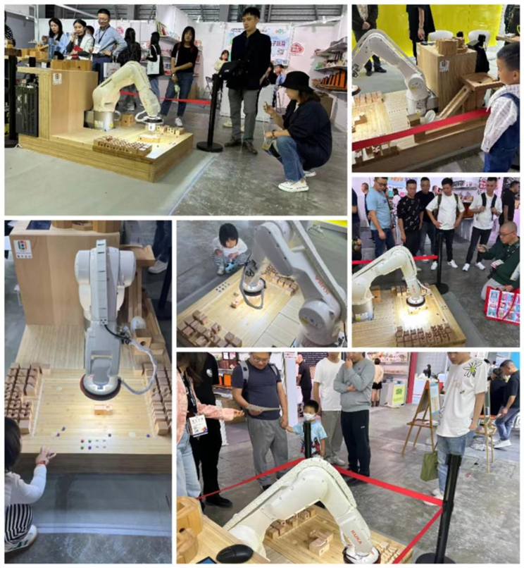
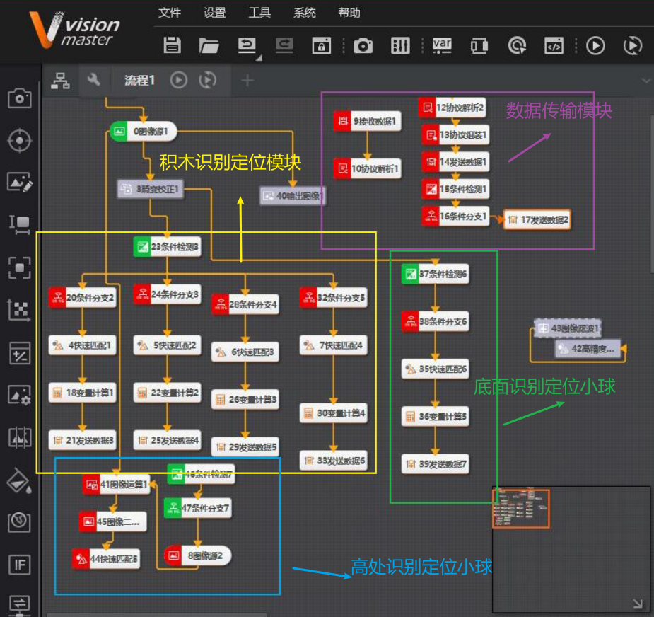

# kuka_robot
# 如何从零开始实现KUKA机械手的视觉
## 该仓库记录了在研二时期的制作的机械臂项目过程，总的实现过程，以及如何在拥有一台KUKA机器人后，从零开始实现我们的机械臂视觉抓取，基于此，读者可以快速上手实现机械手视觉的实现。
视频链接https://github.com/LiSh1Ln/kuka_robot/assets/166976993/ad22f671-b131-4f4f-b02d-ab5afd4c2dba

##机械手的配置信息
详见目录kuka_config

##机械手通信使用KUKA软件包Ethernet KRL 3.1，软件包以及软件使用说明详情见文件Ethernet_KRL。

##其中使用的可视化编程软件VisionMaster，百度网盘链接：https://pan.baidu.com/s/1glZV53EEVuQfRBpmrvTd-g 提取码：f9vk。

